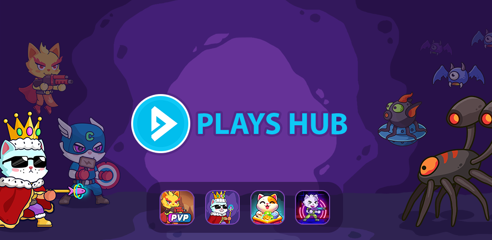

# 📢 INTRODUCTION

Welcome to the PLAYS Hub!

<figure><figcaption></figcaption></figure>

## Our Vision

To build a WEB3 game publishing platform that leverages blockchain technology and decentralized systems to create new monetization opportunities for developers and players.

## Game Hub

Key features of these games include a rich storyline with in-depth gameplay, real-time PvP challenges, true ownership through NFTs, AI-powered features, and diverse monetization models, such as play-to-earn, play-to-airdrop, watch ads to earn, and task-based earning systems.

## Information

🎮 Play on Telegram Bot: https://t.me/playshubbot

📢 Telegram Announcement: https://t.me/PlayshubAnn

&#x20;𝕏   X Channel: https://x.com/PlaysHub

🌐  Website: https://playshub.io

<table data-view="cards"><thead><tr><th></th><th></th><th data-hidden data-card-cover data-type="files"></th><th data-hidden></th><th data-hidden data-card-target data-type="content-ref"></th></tr></thead><tbody><tr><td>CAT Battle</td><td>Create your first site</td><td></td><td></td><td><a href="broken-reference">Broken link</a></td></tr><tr><td>CAT Challenge</td><td>Learn the basics of GitBook</td><td></td><td></td><td><a href="broken-reference">Broken link</a></td></tr><tr><td>Cat Lucky</td><td>Share your docs online</td><td></td><td></td><td><a href="broken-reference">Broken link</a></td></tr></tbody></table>
