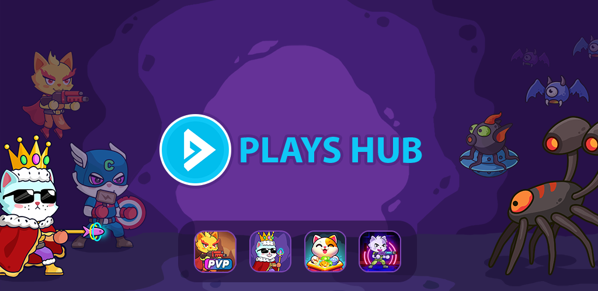

# 📢 INTRODUCTION

Welcome to the PLAYS Hub!

<figure><figcaption></figcaption></figure>

## Our Vision

To build a cutting-edge Web3 game publishing platform that leverages blockchain technology and decentralized systems to deliver an exceptional gaming experience through captivating storylines, immersive and in-depth gameplay, real-time PvP challenges, true digital ownership via NFTs, and innovative monetization models.

## Information

🎮 Play on Telegram Bot: [https://t.me/playshubbot](https://t.me/playshubbot)

📝 White Paper with full details: [https://docs.playshub.io](https://docs.playshub.io/)

📢 Telegram Announcement: [https://t.me/PlayshubAnn](https://t.me/PlayshubAnn)

&#x20;𝕏   X Channel: [https://x.com/PlaysHub](https://x.com/PlaysHub)

🌐 Website: [https://playshub.io](https://playshub.io/)

📩 Contact to Team: [https://t.me/lucasvux](https://t.me/lucasvux)

<table data-view="cards"><thead><tr><th></th><th></th><th data-hidden data-card-cover data-type="files"></th><th data-hidden></th><th data-hidden data-card-target data-type="content-ref"></th></tr></thead><tbody><tr><td>CAT Battle</td><td>The Addictive Survival Game</td><td></td><td></td><td><a href="cat-battle/">cat-battle</a></td></tr><tr><td>CAT Challenge</td><td>The Real-Time PvP game</td><td></td><td></td><td><a href="cat-challenge/">cat-challenge</a></td></tr><tr><td>Cat Lucky</td><td>The Tower of Fortune Game</td><td></td><td></td><td><a href="cat-lucky/">cat-lucky</a></td></tr></tbody></table>
