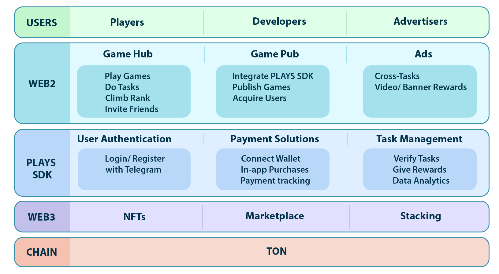

# 📖 Structure

Overall, PLAYS Hub is a web3 game publishing platform that leverages blockchain technology and decentralized systems to create new monetization opportunities for developers and players.&#x20;

The developers submit their games to the PLAYS Hub platform for review by both administrators and the community. Once approved, games must integrate PLAYS SDKs, which enable key Web3 functionalities such as connecting wallet, In-app purchases by Token, On-chain data analytics. Upon successful integration, the games are published on the PLAYS Hub and actively promoted to the user base.

<figure><figcaption></figcaption></figure>
