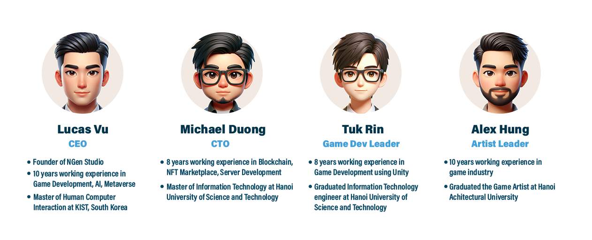
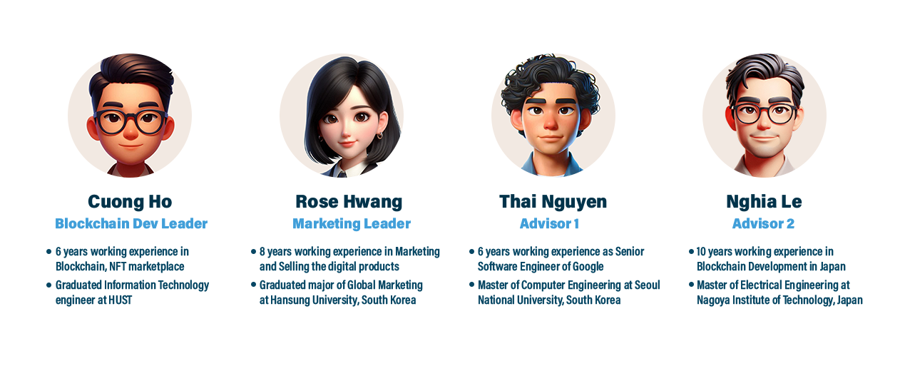

# 🧖‍♂️ Team

Our team’s diverse skill set and extensive experience drive our mission to push the boundaries of what's possible in the digital world. We strongly believe that if other teams can do it, we can do it better.

In game development, we have achieved significant milestones. We have collaborated with top publishers in the US and Israel, developing and publishing several hybrid casual games that have garnered millions of downloads. Our games consistently deliver engaging and immersive experiences to a global audience.

In the realm of Blockchain, our experts have developed numerous projects within the crypto industry, GameFi, NFT marketplace, metaverse catering to clients in South Korea and Japan. Our solutions are known for their security, scalability, and innovation, empowering users with decentralized control and transforming various industries.

Together, we are PLAYS Hub, a powerhouse of innovation and creativity, committed to leading the charge in the next generation of digital experiences.

<figure><figcaption></figcaption></figure>

<figure><figcaption></figcaption></figure>
